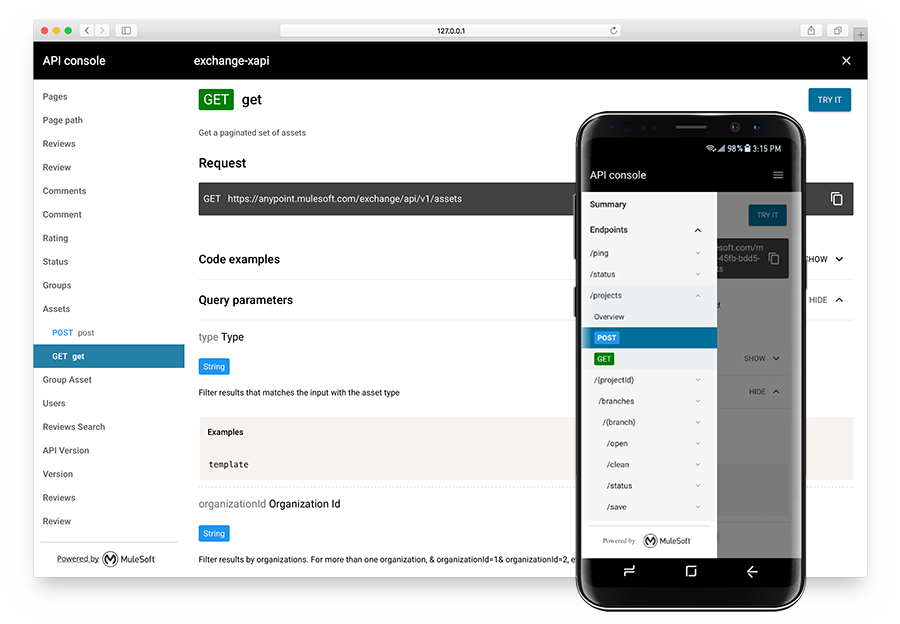

__See live example of the API console in our [demo application][].__

# The API Console

MuleSoft's API Console is a full-fledged API documentation tool that generates mobile-friendly web documentation based on RAML (Restful API Modeling Language) or OAS (Open API specification) documents. In addition to providing documentation, the tool provides the capability for users to try out requests on the fly.



## API console 5.0 is here!

Great news! Next version of API console is here! The upgrade includes new design, new data model and and build process that allows reduce size of the console.

### AMF (AML Modeling Framework) support

We are working very hard to deliver first in class solutions for API documentation.
MuleSoft's AMF allows to parse any* API document and produces common data model. API console consumes this model instead of RAML JS parser's.

\* Currently AMF supports RAML 0.8, RAML 1.0, OAS 2.0 and OAS 3.0. It can be extended by defining new vocabulary to support other API spec formats.

### Redesign

New API console has been tested with users and the redesigned, then tested with used again and then redesigned again to ensure we offer best in class API documentation tools.
New navigation allows understand structure of the API better and users can navigate through the documentation faster.

New documentation page focuses on presenting the information which is the API and not features of the app itself. This allows users to learn faster and be more productive.

### Re-build

New [build tools][] allows you to customize the bundle to your needs and possibly reduce size of the console even more than when using default settings. Check out "Building the console" section for more information.

## Introduction

API console is an web application created on top of the [Web Components specifications](https://www.webcomponents.org/introduction) and powered by the [Polymer library](https://www.polymer-project.org/). Familiarity with Polymer isn't necessary to use the console.

The following sections briefly describe how to build and use the console. For more information, see the [docs](docs) directory in this repository.

## Using the API console

Install our CLI tool globally using `-g` if possible:

```shell
$ sudo npm install -g api-console-cli
```

Generate API console from your RAML or OAS file:

```shell
$ api-console build -t "RAML 1.0" -a path/to/api.raml # works with remote files too
```

Preview the console:

```shell
$ api-console serve build/ --open
```

### Run as a standalone web-application

Recommended way of using API console is to build a standalone application that can be served from your server. Generated sources with `api-console-cli` is production ready bundle of the console ready to be served to your users. The application supports [Deep linking][deep linking], which allows you to share a link to a particular part of your API documentation. You can find a basic example of the standalone application on our [demo application][] web page.

To build the API Console as a standalone application use our [build tools][].

### Using API components

This is advanced option for developers to embed the console or one of it's components into existing web page.

API console is a web component. This mean it can be used in any web environments (browser, Chrome frame, Electron app etc). Also it can be mixed with any framework as it does not reference other frameworks.

This version of the console still works with `bower` as a dependency manager as it works with HTML imports. Next version will work with ES6 module imports which supports npm as a dependency management system.

First, use [Bower][] to install the console and its dependencies:

```bash
$ bower install --save mulesoft/api-console
```

Next, include the element in your web page:

```html
<link rel="import" href="bower_components/api-console/api-console.html">
```

Finally use the HTML tag:

```html
<body>
  <api-console narrow amf-model="{...}"></api-console>
</body>
```

See complete documentation about how to import sources into your web page in the [api console element docs][]. Also, if you are a developer you can check out [demo application source code][].

You can also build API Console as a embeddable HTML element using one of our [build tools][].

## API Console configuration options

Configuration options differ from the previous version. Because API Console is a (custom) HTML element its configuration is based on HTML attributes. You can pass values as an attribute value, or use a boolean option by simply setting the attribute. Configuration from JavaScript code is based on setting a JavaScript property as the attribute name on the element. If the attribute name contains dashes then make the property name [camel case][].

Example:

```html
<api-console append-headers="x-api-key: 1234" narrow></api-console>
```

An equivalent example is:

```javascript
var console = document.querySelector('api-console');
console.narrow = true;
console.appendHeaders = 'x-api-key: 1234';
```

See the full list of API Console configuration options in the [configuring the api console][] document.

## Build tools

A set of build tools is included to help you create API Console from the RAML file. Build tools are configured to produce a production optimized version of API Console. The build tools can generate both standalone and embeddable version of the console. You can also configure data source strategy (RAML, JSON or inline JSON as a data source).

The following build tools are available:

*   The API console CLI
*   Node modules
    *   `api-console-builder`
    *   `amf-client-js`

Depending on your needs you can choose whether you want to use a CLI tool or a node module.

Build tools can be helpful in the CI process to automate the documentation release cycle. See the [build tools][] documentation for more information and build strategies.

## Theming
API Console supports theming and comes with a default theme. You can create your own theme. For example, you can tweak the style of the console to match your corporate style guide.

Theming is based on CSS variables and CSS mixins. Basic concepts of using the variables and mixins are described in the [Polymer 2.0 styling][] documentation. You can check the [api-console-styles.html](api-console-styles.html) file to see the current theme definition, and then read the [theming documentation][] to learn how to create your own theme.

## CORS

Cross-origin resource sharing (CORS) allows sharing resources from one domain to other domains. Browsers block all requests to other domains but with a special set of headers authors can allow other domains to request a resource. For more information, see the [CORS Wiki][].

If your API does not allow CORS and you hosting your API documentation in different domain then API Console won't be able to make a request to an endpoint. API Console currently supports 3 ways of dealing with this issue:

-   by installing the __API Console Chrome extension__
-   by setting up a __proxy server__
-   by handling HTTP requests from the hosting application

Read our [CORS guideline][] for more information about each of these solutions.

## Preview and development

The API Console is a custom element that serves as a shell element for other custom web components. To develop the API Console most probably you'd have to develop one of over a hundred other web components that creates the console. All the elements are described in [the elements catalog][the elements catalogue].

1.  Clone the element.
```
git clone https://github.com/mulesoft/api-console.git
cd api-console
```

2.  Install [polymer-cli][] and [Bower][].
```
sudo npm install -g bower polymer-cli
```

3.  Install dependencies.
```
bower install && npm i
```

4.  Serve the element.
```
polymer serve --open
```

5. If you are planning to parse own RAML/OAS file then additionally run this command to run AMF parsing service for the demo page:
```
npm staret
```

The default page is the element's documentation. Switch to demo to see a working example.

You can also append the `/demo/` to the URL to switch to a demo page permanently.

## Reporting issues and features requests

The API Console is open and we encourage the community to contribute to the project. However, it is very important to follow a few simple rules when you create an issue report or send a pull request.

See CONTRIBUTING.md for description of how to file issue report of feature request.

### Contributor's Agreement

To contribute source code to this repository, read our [contributor's agreement](http://www.mulesoft.org/legal/contributor-agreement.html), and then execute it by running this notebook and following these instructions: [api-notebook.anypoint.mulesoft.com/notebooks/#380297ed0e474010ff43](https://api-notebook.anypoint.mulesoft.com/notebooks/#380297ed0e474010ff43)

## License

The API Console is shared under Common Public Attribution License Version 1.0 (CPAL-1.0).

See the LICENSE.md file for more information.

[deep linking]: https://en.wikipedia.org/wiki/Deep_linking
[demo application]: https://mulesoft.github.io/api-console
[demo application source code]: demo/standalone/index.html
[api console element docs]: docs/api-console-element.md
[build tools]: docs/build-tools.md
[configuring the api console]: docs/configuring-api-console.md
[theming documentation]: docs/theming.md
[camel case]: https://en.wikipedia.org/wiki/Camel_case
[polymer-cli]: https://www.polymer-project.org/1.0/docs/tools/polymer-cli
[Bower]: https://bower.io/
[Polymer 2.0 styling]: https://www.polymer-project.org/2.0/docs/devguide/custom-css-properties
[the elements catalogue]: https://elements.advancedrestclient.com/
[CORS Wiki]: https://en.wikipedia.org/wiki/Cross-origin_resource_sharing
[CORS guideline]: docs/cors.md
