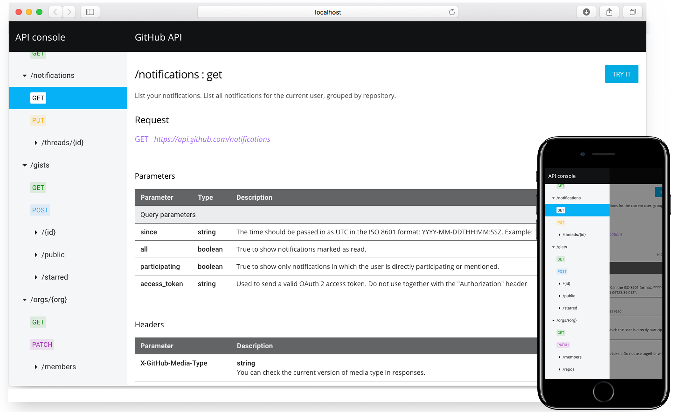

# The API Console

MuleSoft's API Console is a full-fledged API documentation tool that generates mobile-friendly web documentation based on RAML (Restful API Modeling Language) documents. In addition to providing documentation, the tool provides the capability for users to try out requests on the fly.

[](https://mulesoft.github.io/api-console)

**See live example of the API console in our [demo application].**

## Introduction

In this repository, you can find the source for a single HTML element that represents API Console.

The HTML element is built on top of the [Web Components specifications](https://www.webcomponents.org/introduction) and powered by the [Polymer library](https://www.polymer-project.org/). Familiarity with Polymer isn't necessary to use the console.

The following sections briefly describe how to build and use the console. For more information, see the [docs](docs) directory in this repository.

## Using the API console

API Console comes in two flavors.

* A **standalone web-application**  
* embeddable **HTML element**  

You can select which one suits your needs.

### Run as a standalone web-application

Use API Console as a standalone application to display the documentation for your API as a web page. The application supports [Deep linking][deep linking], which allows you to share a link to a particular part of your API documentation. You can find a basic example of the standalone application on our [demo application] web page.

To build the API Console as a standalone application use one of our [build tools].

### Embed as an HTML element

The API Console was built on top of the new Web Components specification. When you include sources of the console into your web application it registers a new HTML element, `<api-console>`. You can use this element in the same way as any other element on the page or web application. For example, you can embed the console into your blog post or as a part of a press release. Your users can explore your API without being redirected to another web page.

First, use [bower] to install the console and its dependencies:

```bash
$ bower install --save mulesoft/api-console
```

Next, include the element in your web page:

```html
<link rel="import" href="bower_components/api-console/api-console.html">
```

Finally use the HTML tag:

```html
<body>
  <api-console raml="{...}"></api-console>
</body>
```

See complete documentation about how to import sources into your web page in the [api console element docs]. Also, if you are a developer you can check out [demo application source code].

You can also build API Console as a embeddable HTML element using one of our [build tools].

## Optimization options

API Console displays documentation for RAML documents by performing heavy duty computations to transform RAML data into a JavaScript object. Naturally, this takes time. There are, however, a few options to optimize loading time of API Console, depending on your use case.

### RAML data source

If your API is under active development and changes often, you may want to consider using the RAML file hosted on a server as a data source. The API Console application will then parse RAML file using the RAML JavaScript parser and use the parser output as a data source. Parsing occurs during API Console load time, but during that time, the latest API version is displayed.

Because this use case requires you to include more custom HTML elements it's not suitable for the standalone version. Other options would be a better fit.

### JSON data source

If your API doesn't change often or if you are using our [build tools] in your CI process, using a JSON data source is a good choice. In this case, you can generate a JSON file from the RAML and use it as a data input in the `<api-console>` element.

This option significantly reduces the API Console load time. It is also suitable for both standalone application and the HTML element.

### Inline JSON in the page source

This option gives you the fastest load time but may increase initial page weight. It is the same option as the JSON data source but the JSON data is not kept in separate JSON file. The data is included in the page source as a JavaScript object.

Use this option if your API rarely, or never, changes. Every change to the source RAML file requires regenerating the whole page, which can be automated with our [build tools].

## API Console configuration options

Configuration options differ from the previous version. Because API Console is a (custom) HTML element its configuration is based on HTML attributes. You can pass values as an attribute value, or use a boolean option by simply setting the attribute. Configuration from JavaScript code is based on setting a JavaScript property as the attribute name on the element. If the attribute name contains dashes then make the property name [camel case].

Example:

```html
<api-console append-headers="x-api-key: 1234" narrow></api-console>
```

An equivalent example is:

```javascript
var console = document.querySelector('api-console');
console.narrow = true;
console.appendHeaders = 'x-api-key: 1234';
```

See the full list of API Console configuration options in the [configuring the api console] document.

## Build tools

A set of build tools is included to help you create API Console from the RAML file. Build tools are configured to produce a production optimized version of API Console. The build tools can generate both standalone and embeddable version of the console. You can also configure data source strategy (RAML, JSON or inline JSON as a data source).

The following build tools are available:

* The `api-console` CLI
* The node modules
  * `api-console-builder`
  * `raml-json-enhance-node`  

Depending on your needs you can choose whether you want to use a CLI tool or a node module.

Build tools can be helpful in the CI process to automate the documentation release cycle. See the [build tools] documentation for more information and build strategies.

## Theming
API Console supports theming and comes with a default theme. You can create your own theme. For example, you can tweak the style of the console to match your corporate style guide.

Theming is based on CSS variables and CSS mixins. Basic concepts of using the variables and mixins are described in the [Polymer 1.0 styling] documentation. You can check the [api-console-styles.html](api-console-styles.html) file to see the current theme definition, and then read the [theming documentation] to learn how to create your own theme.

## CORS

Cross-origin resource sharing (CORS) allows sharing resources from one domain to other domains. Browsers block all requests to other domains but with a special set of headers authors can allow other domains to request a resource. For more information, see the [CORS Wiki].

If your API does not allow CORS and you hosting your API documentation in different domain then API Console won't be able to make a request to an endpoint. API Console currently supports 3 ways of dealing with this issue:

- by installing the **API Console Chrome extension**
- by setting up a **proxy server**
- by handling HTTP requests from the hosting application

Read our [CORS guideline] for more information about each of these solutions.

## Preview and development

The API Console is a custom element that serves as a shell element for other custom web components. To develop the API Console most probably you'd have to develop one of over a hundred other web components that creates the console. All the elements are described in [the elements catalog][the elements catalogue].

1. Clone the element.
```
git clone https://github.com/mulesoft/api-console.git
cd api-console
```

2. Checkout the latest version.
```
git checkout release/4.0.0
```

3. Install [polymer-cli] and [Bower].
```
sudo npm install -g bower polymer-cli
```

4. Install dependencies.
```
bower install
```

5. Serve the element.
```
polymer serve --open -p 8080
```

The default page is the element's documentation. Switch to demo to see a working example.

You can also append the `/demo/` to the URL to switch to a demo page permanently.

## Reporting issues and features requests

The API Console is open and we encourage the community to contribute to the project. However, it is very important to follow a few simple rules when you create an issue report or send a pull request.

See CONTRIBUTING.md for description of how to file issue report of feature request.

### Contributor's Agreement

To contribute source code to this repository, read our [contributor's agreement](http://www.mulesoft.org/legal/contributor-agreement.html), and then execute it by running this notebook and following these instructions: https://api-notebook.anypoint.mulesoft.com/notebooks/#380297ed0e474010ff43

## License

The API Console is shared under Common Public Attribution License Version 1.0 (CPAL-1.0).

See the LICENSE.md file for more information.

[deep linking]: https://en.wikipedia.org/wiki/Deep_linking
[demo application]: https://mulesoft.github.io/api-console
[demo application source code]: demo/api.html
[api console element docs]: docs/api-console-element.md
[build tools]: docs/build-tools.md
[configuring the api console]: docs/configuring-api-console.md
[theming documentation]: docs/theming.md
[camel cased]: https://en.wikipedia.org/wiki/Camel_case
[polymer-cli]: https://www.polymer-project.org/1.0/docs/tools/polymer-cli
[Bower]: https://bower.io/
[Polymer 1.0 styling]: https://www.polymer-project.org/1.0/docs/devguide/styling
[the elements catalogue]: https://elements.advancedrestclient.com/
[bower]: https://bower.io/
[CORS Wiki]: https://en.wikipedia.org/wiki/Cross-origin_resource_sharing
[CORS guideline]: docs/cors.md
