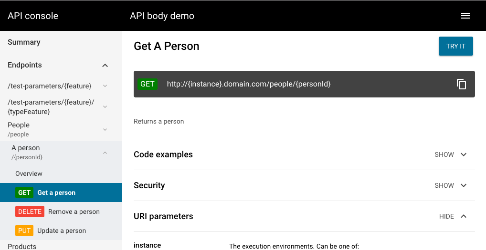
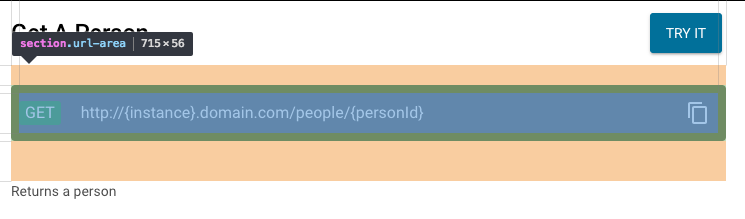
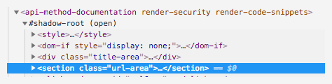
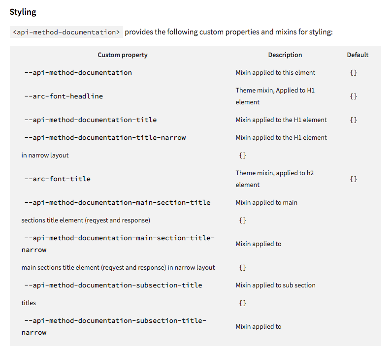
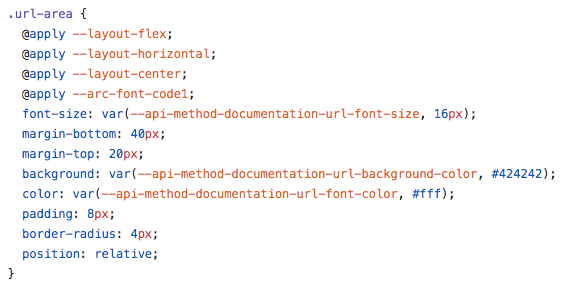

# Styling the API Console

## Before you begin

You should know concept of [shadow DOM][]. Also be familiar with [CSS variables][] and CSS mixins. Basic concepts of using the variables and mixins are described in [Polymer 2.0 styling][] documentation.

This document won't explain how styling web components work. It describes what has to be done to customize styling of API console.

## Theme file

API console has it's styles defined in shadow DOM of element and in API console own theme file.
The [default theme][] is a seperate component which can be used alongside the `api-console` element
to style the console.

Our [build tools][] automatically include default theme element to the compiled bundle. However you can instruct the build tools to use other than default file (by adding `--theme-file` option).

Note that default theme includes `paper-styles/default-theme.html` which is material design default theme for Google's Paper Elements.

## Including theme file

By default API console do not include any theme file. It makes it easier to work with theming.

When developing theme for API console create a demo page that includes API console (source and AMF model) and add reference to your theme file.

Assume the following structure of your theme project:

```
-api-console-acme-theme
  |-bower_components
  |-README.md
  |-index.html
  |-api-console-acme-theme.html
  |-bower.json
```

Then your index.html file would look like:

```html
<!doctype html>
<html>
<head>
  <meta charset="utf-8">
  <meta http-equiv="X-UA-Compatible" content="IE=edge,chrome=1">
  <meta name="viewport" content="width=device-width, minimum-scale=1.0, initial-scale=1, user-scalable=yes">
  <title>API Console Acme Theme Demo</title>
  <script src="bower_components/webcomponentsjs/webcomponents-loader.js"></script>
  <link rel="import" href="bower_components/api-console/api-console.html">
  <link rel="import" href="api-console-acme-theme.html">
</head>
<body>
  <api-console></api-console>
</body>
</html>
```

And finally your `api-console-acme-theme.html` file:

```html
<custom-style>
  <style>
  :root {
    /* Style definition goes here */
  }
  </style>
</custom-style>
```

This setup allows you to start developing your own theme for API console.

For an example of such setup take a look into our [demo page][]. It contains complete example of adding API console, theme file and other components required for the console to work as a standalone application.
It also contains an example of how to use AMF models.

## Developing theme

### Typography

The ARC components typography is based on couple of CSS mixins. They are used in every component.
The whole typography is defined in the following mixins:

```css
/* Common properties */
--arc-font-common-base: {
  /* Base font definition */
};
--arc-font-common-code: {
  /* Base font definition for code block */
};
--arc-font-common-nowrap: {
  /* No wrapping text definition */
};
/* Styles for common objects */
--arc-font-display1: {
 @apply --arc-font-common-base;
};
--arc-font-headline: {
};
--arc-font-title: {
};
--arc-font-subhead: {
};
--arc-font-body2: {
};
--arc-font-body1: {
};
--arc-font-caption: {
};
--select-text: {
};
```

See [default theme][] for an example with values.

### Styles

First thing you need to do is to identify the style (variable or mixin) you'd like to change.


Let's say you are about to style HTTP method documentation page which normally look like this:



To change URL section styles you would have to open Developer Tools (usually it's F12) and select the element.



Identify the custom element that contains this section. Walk up in the DOM tree until you see a custom element (an element that is not standard DOM element).
You can recognize those as an element that has `shadow-root` node.



In this case it is `api-method-documentation`.

#### Webcomponents.org

First option is to check documentaiton page of the component at [webcomponents.org](https://webcomponents.org) website. Go directly to component's page which is [https://www.webcomponents.org/element/advanced-rest-client/api-method-documentation](https://www.webcomponents.org/element/advanced-rest-client/api-method-documentation).
For any other element just append its name to `https://www.webcomponents.org/element/advanced-rest-client/`.
(note that `paper-*`, `iron-*`, and `app-*` elements have different URLs as they are not part of API components ecosystem but you can use search option to find them).

Most of the components contains styling section in the documentaiton page. Find the mixin you are looking for and use it for styling.



Using this documentation you can find the following definitions to style the element:

```css
:root {
  --api-method-documentation-url-font-size: 14px;
  --api-method-documentation-url-background-color: red;
  --api-method-documentation-url-font-color: yellow;
}
```

#### GitHub

If you cannot find styles documentation for the element it means either you cannot style this particular element (there's no API for this in component's definition) or part of documentation is missing.
To be sure you can check component's source which is located at [https://github.com/advanced-rest-client/api-method-documentation](https://github.com/advanced-rest-client/api-method-documentation).
In the source code you can read which variables or mixins are applied to particular element:



If you can't style an element in a way you like you can always fork the component, change it's styling by adding new variable/mixin and send a PR to us. If the change make sense then it will be included into the component library.

[CSS variables]: https://developer.mozilla.org/en-US/docs/Web/CSS/Using_CSS_variables
[Polymer 2.0 styling]: https://www.polymer-project.org/1.0/docs/devguide/styling
[build tools]: build-tools.md
[shadow DOM]: https://developers.google.com/web/fundamentals/web-components/shadowdom
[default theme]: https://github.com/advanced-rest-client/api-console-default-theme
[demo page]: ../demo/standalone/
