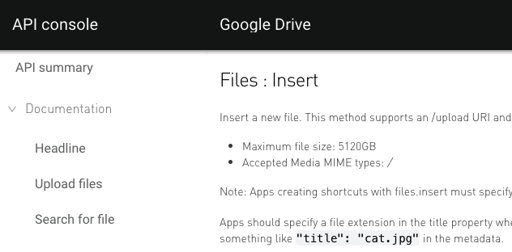
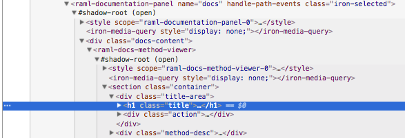

# Styling the API Console

Theming is based on [CSS variables] and CSS mixins. Basic concepts of using the variables and mixins are described in [Polymer 1.0 styling] documentation.

The CSS mixins are not standardized and therefore require additional libraries for support. Polymer has its own implementation of CSS mixins.

## Basics

Basic theme is defined in the [api-console-styles.html](../api-console-styles.html) file. This file contains many CSS variables and mixins definitions.

Each of these definitions is used to style one of the elements for building the API console. The many elements that contain a UI accept, or have their own,  variables / mixins that are applied to element's internal content.

For example `--raml-path-selector-background-color` variable is accepted by the `raml-path-selector` element (main navigation element) and applied to the element's background color.

Consequently, theming is possible for encapsulated web components. Also, most of the variables have an element name prefix for better understanding of where a given variable / mixin is applied.

To start creating your own theme you should be familiar with [ARC elements catalog](https://elements.advancedrestclient.com/). It contains all web components used to build API console plus documentation and a styling guide for all components.

## Identifying styles

Assume you'd like to change a style for the title of the HTTP method in the documentation:



Identify the custom element that contains this title. Use the Chrome DevTools inspector, or an equivalent tool, to inspect the title element.



You see the title is hosted by the `<raml-docs-method-viewer>` element that can be found in the catalog at https://elements.advancedrestclient.com/elements/raml-docs-method-viewer. In the documentation for this element, you see that there are three methods for styling this element:

- `--raml-docs-h1` mixin
- `--raml-docs-method-viewer-title-method-font-weight` variable
- `--arc-font-headline` mixin

Setting any of these properties in your own style definition alters the element styles. You can use the more general `--arc-font-headline` mixin that is applied to any headline (h1) elements in the console. Or, you can use the more specific `--raml-docs-h1` that is applied to all `<h1>`'s in the documentation pages.

```css
:root {
  --raml-docs-h1: {
    color: red;
  };
}
```

Repeat this style for any part of API Console you like.

## Including custom styles into the console

Currently the only way to apply a custom stylesheet in the console is to replace
the original theme file. There are various ways to perform this replacement, depending on how you use the API Console.

If you work on a clone or fork of the repository, you can alter the `api-console-styles.html` file directly.

If you request the `api-console` as a bower component, you have to replace the style file manually each time you update bower components, or you can automate this task.

To automate this task, first create the `.bowerrc` file in your project directory where you keep the `bower.json` file. Add the following code to the file:

```json
{
  "scripts": {
    "postinstall": "node update-styles.js"
  }
}
```

This code runs the `update-styles.js` script in the node each time components are installed or updated.

Next, create the `update-styles.js` file with the following content:

```javascript
const fs = require('fs');

const sourceStyles = 'api-console-styles.html';
const destinationStyles = 'bower_components/api-console/api-console-styles.html';

fs.readFile(sourceStyles, 'utf8', (err, data) => {
  if (err) {
    console.error(err);
    process.exit(1);
    return;
  }
  fs.writeFile(destinationStyles, data, 'utf8', (err) => {
    console.error(err);
    process.exit(1);
    return;
  });
  console.log('API Console styles updated.');
});
```

This code just copies contents from `sourceStyles` file to `destinationStyles` file.

## Sizing the embeddable element

The `api-console` must either be explicitly sized, or contained by an explicitly
sized parent. The parent container also has to be positioned relatively
(`position: relative` CSS property). "Explicitly sized" means the container either has an explicit CSS height property set via a class or inline style, or the size is 
set by the layout in some other way, such as the flex layout or absolute positioning.

[CSS variables]: https://developer.mozilla.org/en-US/docs/Web/CSS/Using_CSS_variables
[Polymer 1.0 styling]: https://www.polymer-project.org/1.0/docs/devguide/styling
[build tools]: build-tools.md
